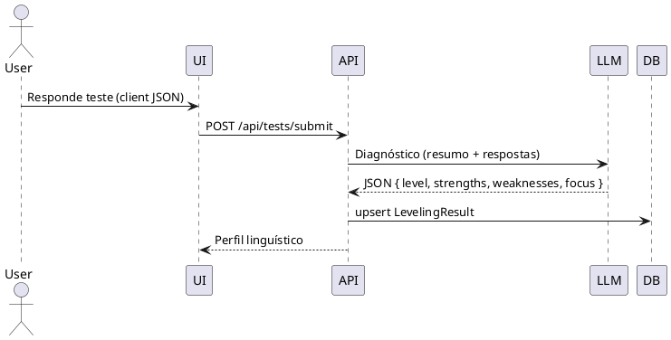
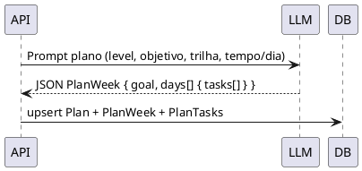
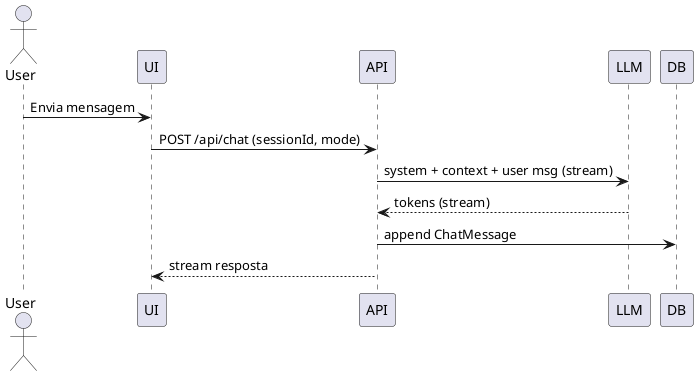

# SPEC-1-English AI Tutor (MVP com loop de engajamento)

## Background

O produto é um **MVP de tutor de inglês com IA** que valida a hipótese de que um **plano de estudos personalizado** + **chat do professor IA** geram valor de aprendizado percebido. A revisão proposta mantém a essência, mas adiciona um **loop de engajamento de 1 semana** com coleta de **feedback direto** para verificar se o usuário sente progresso e se **retorna no dia seguinte**.

Contexto e premissas do MVP:

* **Autenticação** com NextAuth (e‑mail e Google OAuth), salvando no perfil dados mínimos e a **etapa de fluxo** (ex.: `placement_test`).
* **Teste de nivelamento híbrido**: perguntas objetivas/listening no frontend (JSON fixo) + diagnóstico CEFR via OpenAI no backend, retornando **nível, forças, fraquezas e foco inicial**.
* **Definição de objetivo** com 4 opções principais e campo livre para contexto (ex.: entrevista de TI).
* **Plano semanal** estruturado em **metas por semana** e **microtarefas diárias**, armazenado em **JSON** e exibido como checklist simples.
* **Chat “Teacher AI”** com personalidade pedagógica consistente (corrige gentilmente, explica regra em 2 linhas, dá um desafio final).
* **Dashboard** com progresso semanal (com base em tarefas marcadas) e **feedback resumido** no fim da semana (pode ser gerado via IA, mesmo que genérico no MVP).
* **Métrica-chave de sucesso** além da conclusão do plano: **retenção D+1** (≥ 30% retornam no dia seguinte).
* **Monetização**: por ora, **simulação de upgrade premium** para medir interesse antes de integrar cobrança real.

> Objetivo de validação: Demonstrar que os usuários **percebem aprendizado real** e retornam no dia seguinte para continuar o plano, dentro de um ciclo de 7 dias.

---

## Requirements

**Contexto-alvo**: Profissionais de TI brasileiros (PT-BR) que querem **trabalhar para o exterior**, priorizando **preparação para entrevistas** (inglês técnico + behavioral) e avanço contínuo rumo ao **C1**.

### MoSCoW (Produto)

* **Must have**

  * Onboarding com **teste de nivelamento híbrido** (A1–C1) e seleção de **objetivo primário**: *“Conseguir passar em entrevistas de emprego”* (padrão), com variações: Back-end, Front-end, Data, DevOps.
  * **Plano personalizado** com metas semanais (7 dias) e **microtarefas diárias** (10–20 min) alinhadas ao objetivo e nível atual.
  * **Chat Teacher AI** com correção, explicação curta e desafio final; suporta **role-play** de entrevista (behavioral + técnico).
  * **Dashboard** com progresso semanal (checklist) e **feedback de fechamento da semana** gerado pela IA.
  * **Métrica de sucesso D+1**: ≥ **30%** retornam no dia seguinte.
* **Should have**

  * **Simulador de entrevista** com rubrica simples (clareza, gramática, vocabulário técnico, fluência, STAR) e score 0–5 por eixo.
  * **Glossário técnico dinâmico** por trilha (ex.: REST, CI/CD, concurrency, complexity, cloud basics) com exemplos em contexto.
  * **Export do plano** (PDF/Markdown) e link compartilhável do perfil/objetivo.
* **Could have**

  * **Tarefas multimodais**: exercícios de listening com áudio curto e shadowing.
  * **Checklist de portfolio** (CV/resume bullets, LinkedIn pitch, elevator pitch) com prompts orientados.
  * Notificações (e-mail/push) de lembrete de estudo diário e retorno D+1.
* **Won’t have (MVP)**

  * Pagamento real/Stripe (apenas **simulação de upgrade**).
  * Correção de pronúncia por ASR de baixa latência.
  * Recomendação colaborativa entre usuários.

### Requisitos Técnicos

* **Must have**

  * Latência

    * **Geração de plano** ≤ **6 s** p95; **resposta do chat** ≤ **4 s** p95 (streaming habilitado).
  * Persistência: usuários, testes, planos, sessões de chat, feedback semanal (JSON-first).
  * Observabilidade básica: logs de prompts/respostas (pseudonimizados), métricas de uso (D0, D+1, tarefas concluídas), erros p95/p99.
  * Segurança/Privacidade: PII mínima (nome, e-mail), **opt-in** para uso de dados em melhoria do modelo.
* **Should have**

  * Versionamento de prompts e de **templates de tarefas** por trilha (backend, frontend, data, devops).
  * Feature flag para **simulador de entrevista**.
* **Could have**

  * Modo offline limitado (cache do plano da semana no client).

### Sucesso do MVP (KRs)

* **KR1**: ≥ 30% D+1; **KR2**: ≥ 60% dos usuários completam ≥ 4/7 dias da semana 1; **KR3**: **CSAT ≥ 4.2/5** no fim da semana 1; **KR4**: ≥ 70% reportam **maior segurança** em entrevistas (auto-avaliação Likert).

### Método APA (novos requisitos)

* **Formato de aula obrigatório**: cada aula segue **APA – Automatic Presentation and Assimilation**.
* **Duração**: **10–20 minutos** por aula (hard cap no MVP). O plano semanal é composto por 7 **aulas APA** curtas.
* **Fases da aula** (com tempos-alvo):

  1. **Presentation** (4–6min): input guiado (texto curto/áudio/vídeo) com exemplos ancorados no **contexto de entrevista de TI**.
  2. **Assimilation** (4–8min): prática guiada (gap-fills, substitution drills, transformação de frases, mini role-play controlado).
  3. **Active Recall** (2–4min): produção livre breve (voz ou texto) — ex.: responder a uma pergunta típica de entrevista usando o alvo da lição.
  4. **Feedback & Next Step** (≤2min): correção sucinta e desafio final para o chat/teacher.
* **Critérios de aceitação**:

  * Cada aula deve declarar **objetivo linguístico** (ex.: “responder ‘Tell me about yourself’ usando passado simples e vocabulário de stack”).
  * Cada fase tem **tempo estimado** e **artefatos** (prompts/itens) rastreáveis.
  * **Acessibilidade**: sempre oferecer versão texto das atividades de áudio.

## Method

### Estrutura de Aula APA (10–20 min)

**Esquema JSON da aula (MVP):**

```json
{
  "lessonId": "wk1-d1",
  "goal": "Apresentação profissional com foco em stack e responsabilidades",
  "targetLevel": "A2",
  "track": "backend",
  "durationMin": 15,
  "phases": [
    {
      "type": "Presentation",
      "timeMin": 5,
      "items": [
        {"kind": "text", "content": "Hi, I'm a backend engineer working with Node.js and PostgreSQL..."},
        {"kind": "glossary", "terms": ["stack", "deploy", "API", "CI/CD"]}
      ]
    },
    {
      "type": "Assimilation",
      "timeMin": 6,
      "items": [
        {"kind": "gap_fill", "prompt": "I ___ (work) with Node.js to build APIs.", "answer": "work"},
        {"kind": "transform", "from": "I design endpoints.", "to": "Past simple", "answer": "I designed endpoints."}
      ]
    },
    {
      "type": "ActiveRecall",
      "timeMin": 3,
      "items": [
        {"kind": "speech_prompt", "content": "Tell me about your current stack and a recent challenge.", "maxSec": 60}
      ]
    },
    {
      "type": "FeedbackNext",
      "timeMin": 1,
      "items": [
        {"kind": "tip", "content": "Try varying past verbs and add one metric (e.g., response time)."}
      ]
    }
  ]
}
```

**Algoritmo de geração (APA) – Pseudocódigo**

```pseudo
inputs: level_final, track, objetivo=job_interview, disponibilidade(10..20min)
for week in [1]:
  for day in 1..7:
    lesson = new LessonAPA()
    lesson.goal = select_goal(level_final, track, dia=day)
    lesson.durationMin = clamp(disponibilidade, 10, 20)
    lesson.phases = [
      presentation(level_final, track, objetivo),
      assimilation(level_final, track, objetivo),
      active_recall(level_final, track),
      feedback_next()
    ]
    ensure_time_budget(lesson, <= lesson.durationMin)
    attach_roleplay_hook(lesson, to=chat_teacher)
    save(lesson)
```

**Integração com o Plano Semanal**

* Cada **dia** do `PlanWeek` referencia um ``** APA**.
* Ao marcar tarefas, o progresso do dia = soma das fases concluídas.
* O **Active Recall** envia áudio/texto para avaliação rápida (fluência/gramática leve) pelo `Teacher AI`.

### Arquitetura (MVP)

* **Frontend**: Next.js (App Router) com Server Actions para mutações simples e páginas: onboarding, teste, objetivo, plano, chat, simulador de entrevista e dashboard.
* **Autenticação**: Auth.js/NextAuth (e‑mail + Google OAuth). Perfil mínimo salvo no `UserProfile`.
* **Backend**: API Routes (REST) para endpoints públicos autenticados (`/api/tests`, `/api/plans`, `/api/chat`, `/api/interviews`, `/api/feedback`).
* **Orquestração de IA**: camada `ai/` com prompts versionados e **schemas JSON** para respostas estruturadas (diagnóstico, plano, feedback, rubrica de entrevista).
* **Banco**: PostgreSQL (Prisma ORM). Estratégia **JSON-first** para plano/chat e **campos indexados** para consultas críticas (usuário, semana, status).
* **Observabilidade**: logs estruturados (requestId, userId, promptId), contadores de tarefas concluídas e retenção D+1; captura de latências p95.
* **Infra**: Deploy em Vercel (frontend + API). Banco gerenciado (Supabase/Neon/RDS). Sem fila/worker no MVP.

```plantuml
@startuml
skinparam componentStyle rectangle
actor User
component "Next.js App (UI)" as UI
component "API Routes
(Auth, Tests, Plans, Chat, Interviews, Feedback)" as API
database "PostgreSQL" as DB
component "Auth.js / NextAuth" as AUTH
cloud "OpenAI (LLM)" as LLM
User --> UI
UI --> API
API --> AUTH
API --> DB
API --> LLM
@enduml
```

---

### Fluxos principais

#### 1) Teste de Nivelamento (híbrido)

* **Frontend** aplica 5–10 questões de múltipla escolha/listening de um **banco fixo (JSON)** **+ 2 tarefas de speaking**:

  1. **Monólogo livre (45–60s)**: “Tell me about yourself (role: software engineer).” ⇒ mede **fluência**.
  2. **Leitura guiada (20–30s)**: pequeno parágrafo técnico (ex.: deploy com CI/CD) ⇒ mede **pronúncia**.
* **Captura de áudio**: MediaRecorder (WebRTC) em 16kHz mono, exporta **WebM/Opus**; fallback para WAV.
* **Backend** processa áudio com **ASR** (transcrição + timestamps + confidences) ⇒ deriva **métricas** e envia, junto das respostas objetivas, para o LLM gerar o **diagnóstico consolidado**.
* **Saída estruturada**: `level` (A1–C1), `fluency` (0–5), `pronunciation` (0–5), `strengths[]`, `weaknesses[]`, `initial_focus[]`, `confidence` (0–1) e **resumo visual**.

````plantuml
@startuml
actor User
participant UI
participant API
participant ASR
participant LLM
participant DB
User -> UI: MCQ + grava monólogo e leitura
UI -> API: POST /api/tests/submit (respostas + blobs de áudio)
API -> ASR: transcrever + timestamps/confidence
ASR --> API: transcript + word_timestamps
API: calcula métricas (wpm, pausas, fillers, avg_conf)
API -> LLM: (respostas, métricas speaking, heuristic_level)
LLM --> API: JSON { level, fluency, pronunciation, strengths, weaknesses, focus }
API -> DB: upsert LevelingResult
API --> UI: Perfil linguístico (com resumo)
@enduml


#### 2) Geração do Plano de Estudos

* **Entrada**: `level_final`, objetivo "**entrevista de emprego (TI)**", trilha (Back-end/Front-end/Data/DevOps), disponibilidade diária (ex.: 15 min) e **semana = 1**.
* **Saída**: `PlanWeek` com **meta semanal** + **microtarefas por dia** (10–20 min), incluindo tarefas de: vocabulário técnico, listening, speaking (shadowing), grammar gap, e **mini role-play**.



**Esquema JSON do plano (MVP):**

```json
{
  "week": 1,
  "goal": "Apresentação profissional e small talk técnico",
  "days": [
    {
      "day": 1,
      "focus": "Vocabulário: stack, APIs, CI/CD",
      "tasks": [
        "Leia um trecho curto de job description",
        "Anote 8 termos com exemplos",
        "Faça um mini role-play: 'Tell me about your current stack'"
      ]
    }
  ]
}
```

#### 3) Chat “Teacher AI”

* **Prompt base** com persona pedagógica (corrige gentilmente, explica regra em 2 linhas, finaliza com desafio).
* **Modos**: `general`, `interview_roleplay` (mantém contexto e aplica rubrica leve por mensagem quando marcado).



#### 4) Simulador de Entrevista (MVP)

* **Formato**: role‑play no chat com **perguntas behavioral e técnicas**.
* **Rubrica (0–5)** por eixo: **Clareza**, **Gramática**, **Vocabulário técnico**, **Fluência**, **Estrutura (STAR)**.
* **Saída**: score por pergunta + comentário curto e **dica de próxima prática**.

**Pseudocódigo (rubrica):**

```pseudo
rubrica = [clarity, grammar, tech_vocab, fluency, star]
for answer in session.answers:
  LLM -> JSON scores{0..5} + feedback + tip
  store(interview_scores)
final_score = weighted_avg(scores, weights={clarity:1, grammar:1, tech_vocab:1.2, fluency:1, star:0.8})
```

---

### Modelo de Dados (Prisma)

```prisma
model User { id String @id @default(cuid()) email String @unique createdAt DateTime @default(now()) profiles UserProfile[] }
model UserProfile { id String @id @default(cuid()) userId String user User @relation(fields:[userId], references:[id]) name String? level String? objective String? track String? stage String @default("placement_test") createdAt DateTime @default(now()) updatedAt DateTime @updatedAt }
model LevelingTest { id String @id @default(cuid()) userId String user User @relation(fields:[userId], references:[id]) answers Json speakingMonologueUrl String? speakingReadUrl String? asrMonologue Json? asrRead Json? metrics Json? result Json createdAt DateTime @default(now()) }
model StudyPlan { id String @id @default(cuid()) userId String user User @relation(fields:[userId], references:[id]) objective String levelAtCreation String currentWeek Int @default(1) planJson Json createdAt DateTime @default(now()) }
model PlanWeek { id String @id @default(cuid()) planId String plan StudyPlan @relation(fields:[planId], references:[id]) week Int goal String tasks Json progress Int @default(0) createdAt DateTime @default(now()) @@unique([planId, week]) }
model LessonAPA { id String @id @default(cuid()) userId String? track String targetLevel String durationMin Int @default(15) goal String phases Json // [{type,timeMin,items[]}] createdAt DateTime @default(now()) }
model ChatSession { id String @id @default(cuid()) userId String user User @relation(fields:[userId], references:[id]) mode String createdAt DateTime @default(now()) }
model ChatMessage { id String @id @default(cuid()) sessionId String session ChatSession @relation(fields:[sessionId], references:[id]) role String content String createdAt DateTime @default(now()) @@index([sessionId, createdAt]) }
model InterviewSession { id String @id @default(cuid()) userId String user User @relation(fields:[userId], references:[id]) track String level String startedAt DateTime @default(now()) finishedAt DateTime? }
model InterviewItem { id String @id @default(cuid()) interviewId String interview InterviewSession @relation(fields:[interviewId], references:[id]) question String answer String? rubric Json? createdAt DateTime @default(now()) }
model WeeklyFeedback { id String @id @default(cuid()) userId String user User @relation(fields:[userId], references:[id]) week Int summary String metrics Json createdAt DateTime @default(now()) @@unique([userId, week]) }
```

**Regras/invariantes APA**

* `durationMin ∈ [10,20]` (validação de domínio).
* Toda lição tem **Presentation, Assimilation, ActiveRecall, FeedbackNext** (nessa ordem).
* **ActiveRecall** sempre inclui um `speech_prompt` (voz opcional para acessibilidade).
* Cada item tem `kind` e payload mínimo (ex.: `gap_fill.prompt`, `speech_prompt.maxSec`). prisma model User { id String @id @default(cuid()) email String @unique createdAt DateTime @default(now()) profiles UserProfile[] } model UserProfile { id String @id @default(cuid()) userId String user User @relation(fields:[userId], references:[id]) name String? level String? objective String? track String? stage String @default("placement_test") createdAt DateTime @default(now()) updatedAt DateTime @updatedAt } model LevelingTest { id String @id @default(cuid()) userId String user User @relation(fields:[userId], references:[id]) answers Json // MCQ/listening speakingMonologueUrl String? speakingReadUrl String? asrMonologue Json? // {words:[{t0,t1,word,conf}]} asrRead Json? metrics Json? // {wpm, articulationRate, pauseCount, meanPauseMs, fillerRate, avgConf} result Json // { level_final, fluency(0..5), pronunciation(0..5), strengths[], weaknesses[], focus[] } createdAt DateTime @default(now()) } model StudyPlan { id String @id @default(cuid()) userId String user User @relation(fields:[userId], references:[id]) objective String levelAtCreation String currentWeek Int @default(1) planJson Json createdAt DateTime @default(now()) } model PlanWeek { id String @id @default(cuid()) planId String plan StudyPlan @relation(fields:[planId], references:[id]) week Int goal String tasks Json progress Int @default(0) createdAt DateTime @default(now()) @@unique([planId, week]) } model ChatSession { id String @id @default(cuid()) userId String user User @relation(fields:[userId], references:[id]) mode String createdAt DateTime @default(now()) } model ChatMessage { id String @id @default(cuid()) sessionId String session ChatSession @relation(fields:[sessionId], references:[id]) role String content String createdAt DateTime @default(now()) @@index([sessionId, createdAt]) } model InterviewSession { id String @id @default(cuid()) userId String user User @relation(fields:[userId], references:[id]) track String level String startedAt DateTime @default(now()) finishedAt DateTime? } model InterviewItem { id String @id @default(cuid()) interviewId String interview InterviewSession @relation(fields:[interviewId], references:[id]) question String answer String? rubric Json? createdAt DateTime @default(now()) } model WeeklyFeedback { id String @id @default(cuid()) userId String user User @relation(fields:[userId], references:[id]) week Int summary String metrics Json createdAt DateTime @default(now()) @@unique([userId, week]) }

```

**Métricas de speaking (heurísticas MVP):**
- **Fluência**: `wpm` (palavras/min) e **articulationRate** (sem pausas > 300ms).
- **Pausas**: `pauseCount`, `meanPauseMs` usando gaps de timestamps.
- **Filler rate**: frequência de *uh/um/like* (PT/EN) normalizada por minuto.
- **Pronúncia (proxy)**: `avgConf` do ASR + taxa de acertos na **leitura guiada** (palavras lidas ≈ transcritas).
prisma
model User { id String @id @default(cuid()) email String @unique createdAt DateTime @default(now()) profiles UserProfile[] }
model UserProfile { id String @id @default(cuid()) userId String user User @relation(fields:[userId], references:[id]) name String? level String? // A1..C1 objective String? // "job_interview" track String? // backend|frontend|data|devops stage String @default("placement_test") createdAt DateTime @default(now()) updatedAt DateTime @updatedAt }
model LevelingTest { id String @id @default(cuid()) userId String user User @relation(fields:[userId], references:[id]) answers Json result Json // { level_final, strengths[], weaknesses[], focus[] } createdAt DateTime @default(now()) }
model StudyPlan { id String @id @default(cuid()) userId String user User @relation(fields:[userId], references:[id]) objective String // job_interview levelAtCreation String // A1..C1 currentWeek Int @default(1) planJson Json // snapshot completo createdAt DateTime @default(now()) }
model PlanWeek { id String @id @default(cuid()) planId String plan StudyPlan @relation(fields:[planId], references:[id]) week Int goal String tasks Json // [{day, focus, tasks[]}] progress Int @default(0) // % 0..100 createdAt DateTime @default(now()) @@unique([planId, week]) }
model ChatSession { id String @id @default(cuid()) userId String user User @relation(fields:[userId], references:[id]) mode String // general|interview_roleplay createdAt DateTime @default(now()) }
model ChatMessage { id String @id @default(cuid()) sessionId String session ChatSession @relation(fields:[sessionId], references:[id]) role String // user|assistant content String // texto plano or JSON createdAt DateTime @default(now()) @@index([sessionId, createdAt]) }
model InterviewSession { id String @id @default(cuid()) userId String user User @relation(fields:[userId], references:[id]) track String level String startedAt DateTime @default(now()) finishedAt DateTime? }
model InterviewItem { id String @id @default(cuid()) interviewId String interview InterviewSession @relation(fields:[interviewId], references:[id]) question String answer String? rubric Json? // {scores, feedback, tip} createdAt DateTime @default(now()) }
model WeeklyFeedback { id String @id @default(cuid()) userId String user User @relation(fields:[userId], references:[id]) week Int summary String // gerado pela IA metrics Json // {completion%, streak, d1_return?} createdAt DateTime @default(now()) @@unique([userId, week]) }
```

**Índices críticos**

* `ChatMessage(sessionId, createdAt)` para recuperar histórico ordenado.
* `PlanWeek(planId, week)` para renderização rápida do dashboard.
* `WeeklyFeedback(userId, week)` para fechamento semanal.

---

### Prompts (resumo)

**Diagnóstico (LLM)**

* System: "Você é um avaliador CEFR de inglês para profissionais de TI. Seja objetivo."
* Tooling: exigir **JSON** com: `level`, `strengths[]`, `weaknesses[]`, `initial_focus[]`, `confidence`.

**Plano (LLM)**

* System: "Instrutor de inglês para entrevistas de TI. Gere um plano de 7 dias, 10–20min/dia, alinhado ao nível {level} e trilha {track}."
* Output: **JSON** `week`, `goal`, `days[{day, focus, tasks[]}]`.

**Chat/Teacher**

* Persona: amigável, motivador, corrige sem intimidar, **explica a regra em 2 linhas**, encerra com **mini-desafio**.

**Entrevista (rubrica)**

* Pedir **JSON** `{scores:{clarity, grammar, tech_vocab, fluency, star}, feedback, tip}`.

---

### Segurança e Privacidade

* PII mínima; criptografia em trânsito; logs sem conteúdo sensível completo (hash de userId).
* Rate limit por IP/usuário nos endpoints de IA.
* **Opt-in** para uso de dados em melhorias.

### Escalabilidade futura (fora do MVP)

* Fila/worker para avaliações assíncronas e agregados semanais.
* ASR + avaliação de pronúncia.
* Templates de plano versionados por trilha com **A/B de engajamento**.

## DDD & Clean Architecture — Análise Atualizada (Spec 1 com APA 10–20 min)

### ✅ Subdomínios e Bounded Contexts

**Core Domain**

* **Assessment** (Placement): MCQ/listening + speaking (monólogo/leitura) → CEFR, Fluency, Pronunciation.
* **Study Planning & Lessons**: geração do **plano semanal** e **aulas APA** (Presentation → Assimilation → ActiveRecall → FeedbackNext) com duração 10–20 min.
* **Interview Simulation**: role‑play (behavioral/técnico) com rubrica 0–5 e dicas.

**Supporting**

* **Teacher Chat**: chat pedagógico (general/interview_roleplay), correções e mini‑desafios.
* **Progress & Feedback**: progresso diário/semanal, fechamento da semana, CSAT e D+1.
* **Content Catalog**: templates de itens APA, glossário técnico por trilha (backend/frontend/data/devops), prompts versionados.

**Generic**

* **Identity & Access** (Auth/Profile), **Engagement** (lembretes), **Billing (Simulado)**, **Observability** (logs/métricas), **Storage** (áudio/artefatos).

---

### ✅ Entidades, Value Objects e Aggregates

**Aggregates / Entidades**

* **User (Aggregate)**: `User` (root), `UserProfile{level, objective=job_interview, track, stage}`.
* **LevelingTest (Entity)**: `answers`, `speakingMonologueUrl`, `speakingReadUrl`, `asrMonologue`, `asrRead`, `metrics{wpm,...}`, `result{level_final, fluency(0..5), pronunciation(0..5), strengths, weaknesses, focus}`.
* **StudyPlan (Aggregate)**: root `StudyPlan{objective, levelAtCreation, currentWeek}`; entidade `PlanWeek{week, goal, tasksJson, progress}`.
* **LessonAPA (Aggregate)**: root `LessonAPA{lessonId, targetLevel, track, durationMin, goal, phases[]}`.

  * **Phase (Entity/VO)** dentro do agregado: `{type: Presentation|Assimilation|ActiveRecall|FeedbackNext, timeMin, items[]}`.
  * **Items** (VO): `text`, `glossary`, `gap_fill{prompt,answer}`, `transform{from,to,answer}`, `speech_prompt{content,maxSec}`, `tip`.
* **ChatSession (Aggregate)**: root `ChatSession{mode}`; entidade `ChatMessage{role, content}`.
* **InterviewSession (Aggregate)**: root `InterviewSession{track, level, started/finishedAt}`; entidade `InterviewItem{question, answer, rubric{scores, feedback, tip}}`.
* **WeeklyFeedback (Entity)**: `week, summary, metrics{completion%, streak, d1_return}`.

**Value Objects (principais)**

* `CEFRLevel(A1..C1)`, `Track(backend|frontend|data|devops)`, `Objective(job_interview)`, `WeekNumber(1..N)`, `DayNumber(1..7)`.
* `DurationMin(10..20)` **(invariante APA)**, `PhaseType`, `LessonItemKind`, `RubricScore(0..5)`, `FluencyMetrics{wpm, articulationRate, pauseCount, meanPauseMs, fillerRate}`, `PronunciationProxy{avgConf, readMatchRate}`.

**Regras de Negócio (seleção)**

* **APA obrigatório** em toda aula: ordem das fases **fixa**; `durationMin ∈ [10,20]`; cada fase possui `timeMin` e `items` válidos; `ActiveRecall` sempre inclui `speech_prompt`.
* `PlanWeek` referencia 7 `LessonAPA` (1 por dia); publicar lição **congela** conteúdo (versão). Alterações → nova versão.
* `LevelBlendingPolicy`: combina heurística + LLM usando `confidence` para `level_final`.
* Entrevista: rubrica por resposta (0–5) e dica acionável.
* Métricas de sucesso embutidas (D+1 ≥ 30%, 4/7 dias concluídos, CSAT ≥ 4.2).

**Serviços de Domínio**

* `SpeakingMetricsService` → calcula `FluencyMetrics` e `PronunciationProxy` a partir do ASR.
* `LevelBlendingPolicy` → define `level_final`.
* `APALessonAssemblyService` → cria `LessonAPA` consistente com orçamento de tempo e trilha.
* `PlanGenerationService` → orquestra plano/semana, vinculando `LessonAPA` por dia.
* `InterviewEvaluationService` → aplica rubrica e gera `tip`.
* `WeeklyFeedbackService` → sumariza semana, gera conselho próximo.

---

### ✅ Diagrama textual de camadas (Clean Architecture)

```
[Domain]
  Entities/Aggregates: User, UserProfile, LevelingTest, StudyPlan, PlanWeek,
                       LessonAPA(Phase,Item), ChatSession, ChatMessage,
                       InterviewSession, InterviewItem, WeeklyFeedback
  Value Objects: CEFRLevel, Track, Objective, DurationMin, PhaseType, LessonItemKind,
                 RubricScore, FluencyMetrics, PronunciationProxy
  Domain Services: SpeakingMetricsService, LevelBlendingPolicy,
                   APALessonAssemblyService, PlanGenerationService,
                   InterviewEvaluationService, WeeklyFeedbackService
  Domain Events: UserReturnedNextDay, LessonCompleted, WeekCompleted, InterviewFinished

[Application (Use Cases)]
  RegisterUser, UpdateProfile
  SubmitLevelingAnswers, UploadSpeakingAudio, FinalizeLeveling
  GeneratePlanWeek, GenerateAPALessonForDay, MarkPhaseDone, MarkTaskDone
  StartChatSession, SendChatMessage(mode)
  StartInterviewSimulation, SubmitInterviewAnswer, CloseInterviewSession
  GenerateWeeklyFeedback, RecordReturnEvent, GetDashboard

[Interface Adapters]
  Controllers: AuthController, TestsController, PlansController, LessonsController,
               ChatController, InterviewsController, FeedbackController
  DTOs/Presenters: LevelingResultDTO, PlanWeekDTO, LessonAPADTO,
                   InterviewReportDTO, DashboardDTO
  Repositories (ports): UserRepo, LevelingTestRepo, StudyPlanRepo, LessonRepo,
                        ChatRepo, InterviewRepo, WeeklyFeedbackRepo, ContentRepo
  Gateways (ports): LLMGateway, ASRGateway, StorageGateway(S3), NotificationGateway,
                    Clock, IdGenerator

[Infrastructure]
  DB(PostgreSQL/Prisma), Object Storage(S3‑compat)
  LLM Provider(OpenAI), ASR Provider(Deepgram/Whisper)
  Auth(NextAuth), Observability(Logs/Metrics), Email/Push(optional)
```

---

### ✅ Casos de uso (linguagem natural)

* **SubmitLevelingAnswers**: recebe MCQ/listening; persiste parcial.
* **UploadSpeakingAudio**: recebe monólogo/leitura; chama ASR; calcula métricas de fluência/pronúncia (VOs).
* **FinalizeLeveling**: envia pacote ao LLM; aplica `LevelBlendingPolicy`; atualiza `UserProfile.level` e guarda `LevelingTest`.
* **GeneratePlanWeek**: cria semana 1 alinhada a objetivo/trilha/nível; vincula 7 `LessonAPA`.
* **GenerateAPALessonForDay**: monta aula do dia com **APA** respeitando **10–20 min** e metas do dia (Presentation→Assimilation→ActiveRecall→FeedbackNext).
* **MarkPhaseDone**: marca fase concluída; se última fase, dispara `LessonCompleted` e atualiza progresso.
* **StartChatSession/SendChatMessage**: inicia chat; modo `interview_roleplay` pode puxar itens de `LessonAPA.ActiveRecall`.
* **StartInterviewSimulation**/**SubmitInterviewAnswer**/**CloseInterviewSession**: ciclo de entrevista com rubrica e relatório.
* **GenerateWeeklyFeedback**: resume semana com métricas e próxima recomendação.
* **RecordReturnEvent**/**GetDashboard**: registra D+1 e agrega dados do painel.

---

### ✅ Observações de decisões arquiteturais

* **APA como regra de domínio**: invariantes garantidos por `APALessonAssemblyService` e VOs (`DurationMin`, `PhaseType`).
* **JSON-first + versionamento** nos conteúdos de lição, com chaves indexadas para leitura rápida.
* **Gateways isolam fornecedores** (LLM/ASR/Storage), facilitando troca e testes com *fakes*.
* **Idempotência** e `requestId` nos casos de uso com chamadas externas.
* **Evolução segura**: `LessonAPA` versionada por dia; `PlanWeek` congelado ao publicar; alterações geram nova versão.
* **Medição embutida**: cada caso de uso emite eventos/métricas (latência p95, conclusão de fases, D+1, CSAT).

---

## Implementation

### Backlog para GitHub (Issues por Épico, com critérios e estimativa)

> Sugestão de **labels**: `epic`, `frontend`, `backend`, `infra`, `ai`, `asr`, `security`, `observability`, `good-first-issue`, `blocked`, `mvp`.
> Sugestão de **milestones**: `M1-Setup`, `M2-Assessment`, `M3-Plan+APA`, `M4-Chat+Interview`, `M5-Deploy+Feedback`.

---

#### EPIC-1: Setup & Auth (`epic`, Milestone `M1-Setup`)

1. **Inicializar monorepo Next.js + Prisma** (`frontend`,`backend`,`infra`,`mvp`)
   **Descrição:** Criar projeto Next.js (App Router), configurar TypeScript, ESLint, Prettier, Prisma, variáveis `.env`.
   **Aceite:** `pnpm dev` sobe app; `prisma migrate dev` cria DB.
   **Estimativa:** 3 pts

2. **Auth com NextAuth (Email + Google)** (`backend`,`security`,`mvp`)
   **Descrição:** Rotas de auth, callback, sessão; tabela `User`.
   **Aceite:** login por e‑mail e Google funcionando; sessão disponível no server/client.
   **Estimativa:** 3 pts

3. **UserProfile básico + etapa de fluxo** (`backend`,`mvp`)
   **Descrição:** Modelo `UserProfile` (name, level?, objective?, track?, stage=`placement_test`).
   **Aceite:** `POST /api/profile` atualiza perfil; stage muda conforme fluxo.
   **Estimativa:** 2 pts

4. **Observabilidade mínima** (`observability`,`infra`)
   **Descrição:** Logger estruturado (requestId, userId); métricas básicas (route latency p95).
   **Aceite:** Logs em dev e produção; dashboard simples em console.
   **Estimativa:** 2 pts

---

#### EPIC-2: Assessment (Teste Híbrido CEFR + Speaking) (`epic`, Milestone `M2-Assessment`)

5. **Banco de questões MCQ/listening (JSON)** (`frontend`,`mvp`)
   **Descrição:** Estruturar arquivo/coleção com 20–30 itens tagueados por nível A1–B1 e trilha.
   **Aceite:** Endpoint `GET /api/tests/items` retorna lote pseudo‑aleatório por nível.
   **Estimativa:** 3 pts

6. **UI do teste (MCQ + upload de áudio)** (`frontend`,`mvp`)
   **Descrição:** Página de teste com progresso, MCQ, captura de áudio WebRTC (WebM/Opus 16kHz).
   **Aceite:** Envia respostas e blobs; reenvio em caso de falha.
   **Estimativa:** 5 pts

7. **Endpoint `POST /api/tests/upload-audio`** (`backend`,`asr`)
   **Descrição:** Recebe áudio, armazena em S3, retorna URL temporária.
   **Aceite:** Link acessível para processamento; valida tamanho e tipo.
   **Estimativa:** 3 pts

8. **Gateway ASR + cálculo de métricas** (`backend`,`asr`,`ai`)
   **Descrição:** Implementar `ASRGateway.transcribe` + `SpeakingMetricsService` (WPM, pausas, fillers, avgConf).
   **Aceite:** Retorna transcript + `metrics` persistidos no `LevelingTest`.
   **Estimativa:** 5 pts

9. **Diagnóstico LLM consolidado** (`backend`,`ai`)
   **Descrição:** `LLMGateway.completeJson` com schema {level, strengths, weaknesses, focus, confidence, fluency, pronunciation}.
   **Aceite:** `POST /api/tests/submit` salva `result` e atualiza `UserProfile.level`.
   **Estimativa:** 5 pts

10. **Resumo visual do perfil** (`frontend`)
    **Descrição:** Card com CEFR, fluency/pronunciation (0–5) e foco inicial.
    **Aceite:** Renderiza após submit; botão “Gerar plano da semana”.
    **Estimativa:** 2 pts

---

#### EPIC-3: Study Plan + APA Lessons (10–20 min) (`epic`, Milestone `M3-Plan+APA`)

11. **Modelos Prisma: StudyPlan, PlanWeek, LessonAPA** (`backend`,`mvp`)
    **Descrição:** Aplicar schema do Spec 1 com índices críticos.
    **Aceite:** Migração aplicada; CRUD básico via Prisma.
    **Estimativa:** 3 pts

12. **Serviço de montagem APA (`APALessonAssemblyService`)** (`backend`,`ai`)
    **Descrição:** Montar fases Presentation→Assimilation→ActiveRecall→FeedbackNext dentro do orçamento 10–20 min.
    **Aceite:** Função retorna JSON válido e respeita invariantes.
    **Estimativa:** 5 pts

13. **Gerar Semana 1 (GeneratePlanWeek)** (`backend`,`ai`)
    **Descrição:** Caso de uso cria `PlanWeek` (7 dias) e 7 `LessonAPA` vinculadas por dia.
    **Aceite:** Endpoint `POST /api/plans/generate` cria semana e retorna DTO.
    **Estimativa:** 5 pts

14. **UI do plano (checklist diário + tempo por fase)** (`frontend`)
    **Descrição:** Página mostra metas da semana e lições diárias (fases com duração).
    **Aceite:** Marcar fase conclui progresso; bloqueio de ordem opcional.
    **Estimativa:** 5 pts

15. **Validador de invariantes APA** (`backend`)
    **Descrição:** VO `DurationMin(10..20)`, `PhaseType`, `LessonItemKind`; valida conteúdo antes de salvar.
    **Aceite:** Requests inválidos rejeitados (422).
    **Estimativa:** 3 pts

---

#### EPIC-4: Teacher Chat + Interview Simulation (`epic`, Milestone `M4-Chat+Interview`)

16. **ChatSession + streaming LLM** (`backend`,`ai`)
    **Descrição:** Caso de uso `SendChatMessage` (modes: general|interview_roleplay); persistência incremental.
    **Aceite:** Resposta em streaming; histórico salvo.
    **Estimativa:** 5 pts

17. **UI Chat com persona pedagógica** (`frontend`)
    **Descrição:** Prompt base (corrige gentilmente, 2 linhas de regra, mini-desafio).
    **Aceite:** Alterna modos; mostra dicas.
    **Estimativa:** 3 pts

18. **Simulador de entrevista (rubrica 0–5)** (`backend`,`ai`)
    **Descrição:** `InterviewEvaluationService` gera `{scores, feedback, tip}` por resposta; média ponderada final.
    **Aceite:** Endpoint `POST /api/interviews/answer` retorna avaliação.
    **Estimativa:** 5 pts

19. **UI Simulador** (`frontend`)
    **Descrição:** Fluxo pergunta → resposta → score + próxima dica.
    **Aceite:** Relatório final exportável (Markdown).
    **Estimativa:** 3 pts

---

#### EPIC-5: Dashboard, Feedback & Métricas (`epic`, Milestone `M5-Deploy+Feedback`)

20. **Dashboard do usuário** (`frontend`)
    **Descrição:** Nível, objetivo, progresso semanal, último feedback.
    **Aceite:** Carrega em <1s em cache; acessível logado.
    **Estimativa:** 3 pts

21. **WeeklyFeedbackService + fechamento da semana** (`backend`,`ai`)
    **Descrição:** Sumariza progresso e gera texto curto.
    **Aceite:** `POST /api/feedback/week/close` cria registro único/semana.
    **Estimativa:** 3 pts

22. **Métricas de retenção D+1** (`backend`,`observability`)
    **Descrição:** Evento de retorno; agregação diária e endpoint de leitura.
    **Aceite:** Planilha/JSON com `%D+1` por dia.
    **Estimativa:** 2 pts

23. **Simulação de upgrade** (`frontend`)
    **Descrição:** Banner/modal premium (sem pagamento).
    **Aceite:** Click registra evento de interesse.
    **Estimativa:** 1 pt

24. **Deploy (Vercel + DB gerenciado + Storage S3)** (`infra`)
    **Descrição:** Pipelines, variáveis, domínios.
    **Aceite:** Ambiente `prod` online com monitoramento básico.
    **Estimativa:** 3 pts

---

### Templates copiáveis para Issues (Markdown)

**Template geral**

```md
### Contexto
Breve contexto do porquê.

### Escopo
- [ ] Item 1
- [ ] Item 2

### Critérios de Aceitação
- [ ] AC1
- [ ] AC2

### Notas Técnicas
- Tech notes, links, DTOs

**Labels:** frontend, backend, ai, asr, infra, security, observability, mvp
**Milestone:** Mx
**Estimativa:** N pts
```

**Issue exemplo — EPIC-2 / Gateway ASR + métricas**

```md
### Contexto
Precisamos transcrever os áudios do nivelamento e extrair métricas de fluência/pronúncia.

### Escopo
- [ ] Implementar `ASRGateway.transcribe(audioUrl)`
- [ ] Calcular `FluencyMetrics` (wpm, pauses, fillers) e `PronunciationProxy` (avgConf, readMatchRate)
- [ ] Persistir em `LevelingTest.metrics`

### Critérios de Aceitação
- [ ] Dado um áudio válido, retorna transcript + métricas calculadas
- [ ] Erros de provider são tratados e logados com `requestId`
- [ ] Testes unitários para `SpeakingMetricsService`

### Notas Técnicas
- Formato alvo: WebM/Opus 16 kHz
- Timeout de transcrição: 30s; tamanho máximo: 10MB

**Labels:** backend, asr, ai, mvp
**Milestone:** M2-Assessment
**Estimativa:** 5 pts
```


